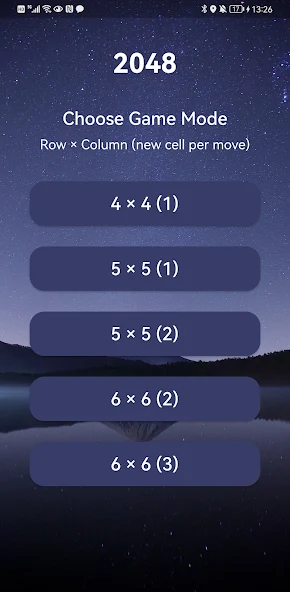
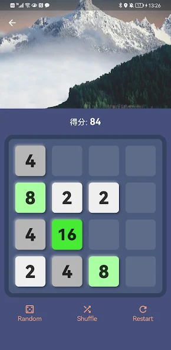

# 🎮 Classic 2048 Game

## 📝 Overview

Classic 2048 is a mobile puzzle game inspired by the original 2048 game developed using Flutter. The objective is to slide numbered tiles on a grid to combine them and create a tile with the number 2048.

[Available on Google Play](https://play.google.com/store/apps/details?id=com.appsbay.classic_2048)

## 🌟 Features

- 📐 **Multiple Grid Sizes**: Choose from 4x4, 5x5, and 6x6 grids for different levels of difficulty.
- 🎲 **Random and Shuffle Options**: Mix up the tiles with Random and Shuffle buttons to add an extra challenge.
- 🖼️ **Beautiful Backgrounds**: Enjoy stunning background images as you play, inspired by nature and scenic locations.
- 💫 **Smooth Animations**: Experience smooth and fluid animations that enhance gameplay.
- 👤 **User-friendly Interface**: Simple and intuitive UI design for an engaging user experience.

## Screenshots

## 🎮 How to Play

1. **Choose Game Mode**: Select your preferred grid size.
2. **Slide to Play**: Swipe in any direction to move the tiles. When two tiles with the same number touch, they merge into one.
3. **Aim for 2048**: Keep merging tiles until you create a tile with the number 2048.
4. **Use Shuffle and Random**: If you're stuck, use the Shuffle or Random buttons to mix up the board.

## 🤝 Contribution

Feel free to fork this repository and submit pull requests. For major changes, please open an issue first to discuss what you would like to change.

## 📄 License

This project is licensed under the MIT License.